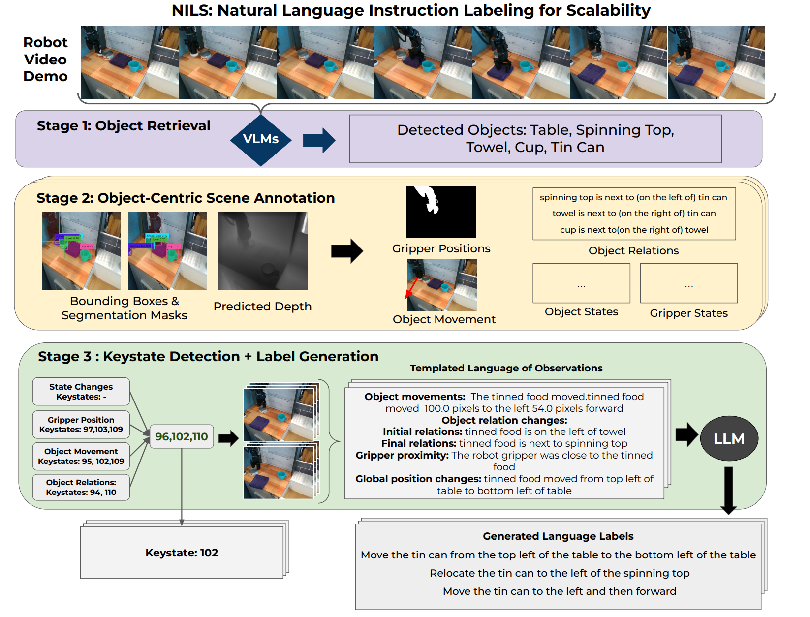

---

<html data-theme="light">

</html>

<link rel="stylesheet" href="./static/css/bulma.min.css">

    

        <h2>Abstract</h2>
        

            A central challenge towards developing robots that can relate human language to their perception and actions
            is the scarcity of natural language annotations in diverse robot datasets. Moreover, robot policies that
            follow natural language instructions are typically trained on either templated language or expensive
            human-labeled instructions, hindering their scalability. To this end, we introduce <b>NILS</b>:
            <b>N</b>atural language <b>I</b>nstruction <b>L</b>abeling for <b>S</b>calability. NILS automatically labels
            uncurated, long-horizon robot data at scale in a zero-shot manner without any human intervention. NILS
            combines pre-trained vision-language foundation models in a sophisticated, carefully considered manner in
            order to detect objects in a scene, detect object-centric changes, segment tasks from large datasets of
            unlabelled interaction data and ultimately label behavior datasets. Evaluations on BridgeV2 and a kitchen
            play dataset show that NILS is able to autonomously annotate diverse robot demonstrations of unlabeled and
            unstructured datasets, while alleviating several shortcomings of crowdsourced human annotations.
        

    

---

## Technical Summary
<video width="100%" controls muted loop playsinline>
    <source src="/static/video/NILS_new.mp4" type="video/mp4">
</video>

---

<!-- > Note: This is an example of a Jekyll-based project website template: [Github link](https://github.com/shunzh/project_website).\
> The following content is generated by ChatGPT. The figure is manually added. -->

## Architecture

Overview of the proposed NILS framework for labeling long-horizon robot play sequences
in a zero-shot manner using an ensemble of pretrained expert models. NILS consists of three stages:
- all relevant objects in the video are detected
- object-centric changes are detected and collected
- object change information is used to detect keystates and an LLM is prompted to generate a language label for the task

---
<h2>Examples</h2>
These Examples showcase annotations generated by our framework and the respective scene annotations. Press Play to start playing the long-horizon trajectory and sample to sample a new trajectory.

    

        <h4>Video</h4>
        <video id="nils-video" width="100%" muted playsinline>
            <source src="" type="video/mp4">
        </video>
    

    

        <h4>Last Keystate</h4>
        <canvas id="nils-keystate" width="100%" height="100%"></canvas>
    

    

        <h4>Scene Annotations</h4>

        

            

                

                    <video id="nils-video-depth" width="100%" muted playsinline>
                        <source src="" type="video/mp4">
                    </video>
                

                

                    <video id="nils-video-boxes" width="100%" muted playsinline>
                        <source src="" type="video/mp4">
                    </video>
                

                

                    <video id="nils-video-masks" width="100%" muted playsinline>
                        <source src="" type="video/mp4">
                    </video>
                

                

                    <video id="nils-video-robot" width="100%" muted playsinline>
                        <source src="" type="video/mp4">
                    </video>
                

            

        

    

    

        

            <button id="nils-sample-button" class="button">Sample</button>
            <button id="nils-play-pause-button" class="button">Play/Pause</button>
            <!-- <button id="nils-prev-key-button" class="button">Previous Keystate</button>
            <button id="nils-next-key-button" class="button">Next Keystate</button> -->
        

    

    

        <h4>Generated Labels</h4>
        

    

---
## Example Labeling Videos

These videos showcase the annotations generated by NILS on BridgeV2 and Fractal. The bounding boxes are the boxes obtained after Stage 2 and NILS' filtering steps.

<!--Bounding boxes are generated using GroundingDINO with object descriptions generated by querying a VLM for names. The queried names and the bounding boxes are used to select consistent and representative object names across frames by leveraging *temporal consensus*, *co-occurrence* and *object detection alignment*. They are also used to compute object movement and relations, which, alongside other signals such as end-effector position, gripper state and timestamp, are used to detect keystates and create a set of templated language observations. Using these, NILS then generates natural language descriptions of the task by querying an LLM with suitable prompt.-->

    

        

            <iframe style="width: 100%; aspect-ratio: 16 / 9;" src="https://www.youtube-nocookie.com/embed/o22Y-kc8gEk" title="YouTube video player" frameborder="0" allow="autoplay; clipboard-write; encrypted-media; picture-in-picture; web-share" referrerpolicy="strict-origin-when-cross-origin" allowfullscreen></iframe>
            
Annotations for Bridge V2

        

        

            <iframe style="width: 100%; aspect-ratio: 16 / 9;" src="https://www.youtube-nocookie.com/embed/cqGS5_mlJLw" title="YouTube video player" frameborder="0" allow="autoplay; clipboard-write; encrypted-media; picture-in-picture; web-share" referrerpolicy="strict-origin-when-cross-origin" allowfullscreen></iframe>
            
Annotations for Fractal 2022

        

    

---
<h2>Policy Rollouts</h2>
These examples showcase some tasks performed by a policy trained on our real-kitchen dataset that is annotated by NILS. The policy is evaluated on the same toy kitchen.

    

        

            

                <video autoplay muted loop playsinline>
                    <source src="/static/video/real_rollout/Archive/banana_in_sink.mp4" type="video/mp4">
                </video>
            

            

                <video autoplay muted loop playsinline>
                    <source src="/static/video/real_rollout/Archive/fridge_fail.mp4" type="video/mp4">
                </video>
            

            

                <video autoplay muted loop playsinline>
                    <source src="/static/video/real_rollout/Archive/microwave_door.mp4" type="video/mp4">
                </video>
            

        

        

            

                <video autoplay muted loop playsinline>
                    <source src="/static/video/real_rollout/Archive/open_microwave.mp4" type="video/mp4">
                </video>
            

            

                <video autoplay muted loop playsinline>
                    <source src="/static/video/real_rollout/Archive/open_oven_fail.mp4" type="video/mp4">
                </video>
            

            

                <video autoplay muted loop playsinline>
                    <source src="/static/video/real_rollout/Archive/pot_to_the_rigth_2.mp4" type="video/mp4">
                </video>
            

        

        

            

                <video autoplay muted loop playsinline>
                    <source src="/static/video/real_rollout/Archive/oven_fridge_fail.mp4" type="video/mp4">
                </video>
            

            

                <video autoplay muted loop playsinline>
                    <source src="/static/video/real_rollout/Archive/pot_in_sink_2.mp4" type="video/mp4">
                </video>
            

            

                <video autoplay muted loop playsinline>
                    <source src="/static/video/real_rollout/Archive/pot_in_sink.mp4" type="video/mp4">
                </video>
            

        

    

Following examples are rollouts of an Octo policy trained on the BridgeV2 dataset using the labels generated by NILS. Both real-world and simulation (using SimplerEnv) rollouts were performed.

    

        

            

                <video autoplay muted loop playsinline>
                    <source src="/static/video/bridge/ra.mp4" type="video/mp4">
                </video>
                
Place the green spoon on top of the rag

            

            

                <video autoplay muted loop playsinline>
                    <source src="/static/video/bridge/rb.mp4" type="video/mp4">
                </video>
                
Place the green spoon on top of the rag

            

        

        

            

                <video autoplay muted loop playsinline>
                    <source src="/static/video/bridge/rc.mp4" type="video/mp4">
                </video>
                
Place the sushi inside the wooden bowl

            

            

                <video autoplay muted loop playsinline>
                    <source src="/static/video/bridge/rd.mp4" type="video/mp4">
                </video>
                
Place the sushi inside the green bowl

            

        

        

            

                <video autoplay muted loop playsinline>
                    <source src="/static/video/bridge/sa.mp4" type="video/mp4">
                </video>
                
Place the yellow spoon on top the blue cloth

            

            

                <video autoplay muted loop playsinline>
                    <source src="/static/video/bridge/sb.mp4" type="video/mp4">
                </video>
                
Relocate the yellow spoon from the table to inside the blue cloth

            

        

    

---
<h2>Failure Cases</h2>

    

        

            

                

                    

                        

                            
                        

                        

                            Move the fork forward  
                            Move the fork to the left  
                            Move the fork away from the round object  
                            Move the fork to the left
                        

                    

                

                

                    

                        

                            
                        

                        

                            Move the pan to the left of the stovetop  
                            Clean the pan with the kitchen towel  
                            Place the pan on top of the kitchen towel, next to the chicken wing and spoon  
                            Move the pan 29.5 pixels to the left and 79.5 pixels forward
                        

                    

                

                

                    

                        

                            
                        

                        

                            Wipe the table  
                            Dust the lamp  
                            Polish the silverware  
                            Wipe up the spill  
                        

                    

                

                

                    

                        

                            
                        

                        

                            Move the toy corn to the left of the blue cup 
                            Place the toy corn in the center of the table, next to the blue
                                cup 
                            Shift the toy corn 130.5 pixels to the right 
                            Relocate the toy corn from the left side of the table to the center
                        

                    

                

                

                    

                        

                            
                        

                        

                            Move the soda can to the right and place it next to the toy mouse  
                            Pick up the soda can and place it to the  left of the toy mouse   
                            Relocate the soda can from its initial position to the left of the toy mouse  
                            Place the soda can next to the toy mouse on its left side
                        

                    

                

                

                    

                        

                            
                        

                        

                            Remove the pot lid from the  sausage toy   
                            Lift the pot lid off the  sausage toy   
                            Take the pot lid off the  sausage toy   
                            Uncover the  sausage toy  by removing the pot lid  
                        

                    

                

            

        

    

<!-- 

<video  autoplay muted loop playsinline>
    <source src="/static/video/real_rollout/Archive/pot_to_the_right.mp4" type="video/mp4">
</video>

 -->
